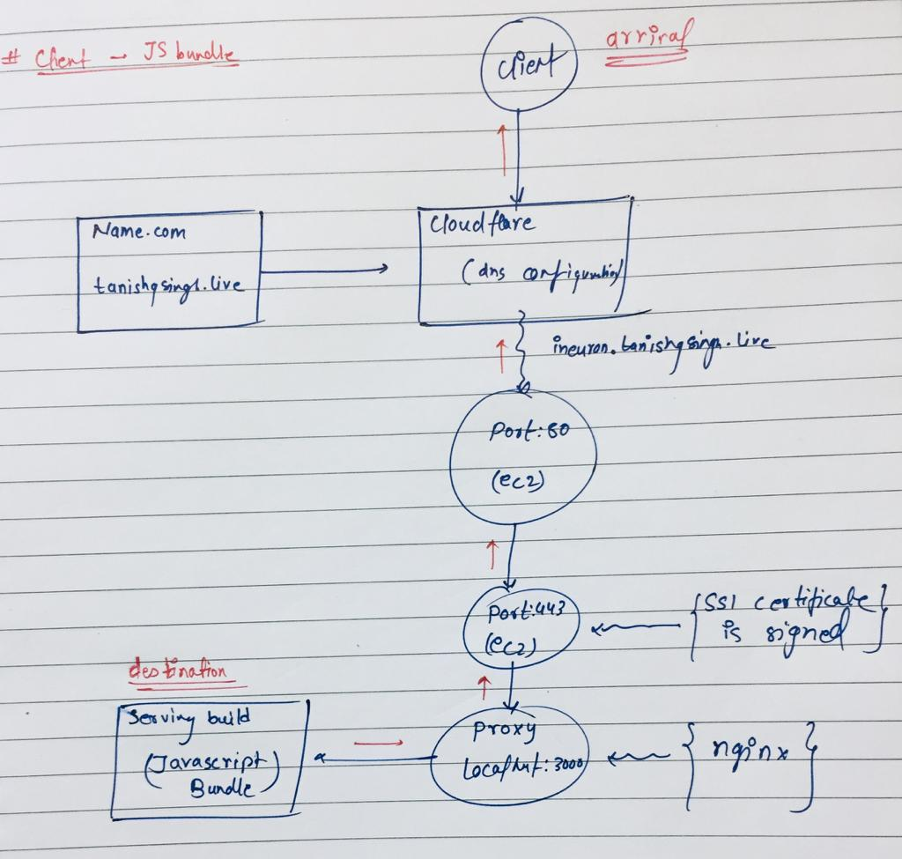
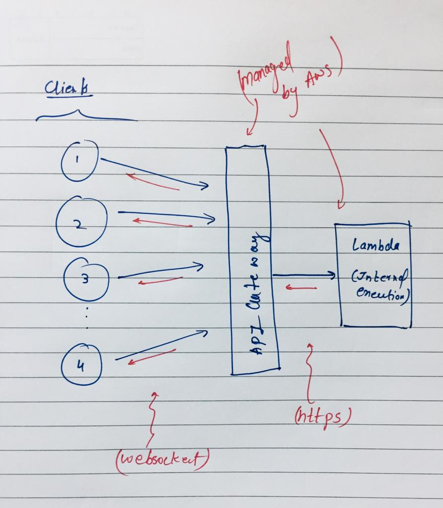
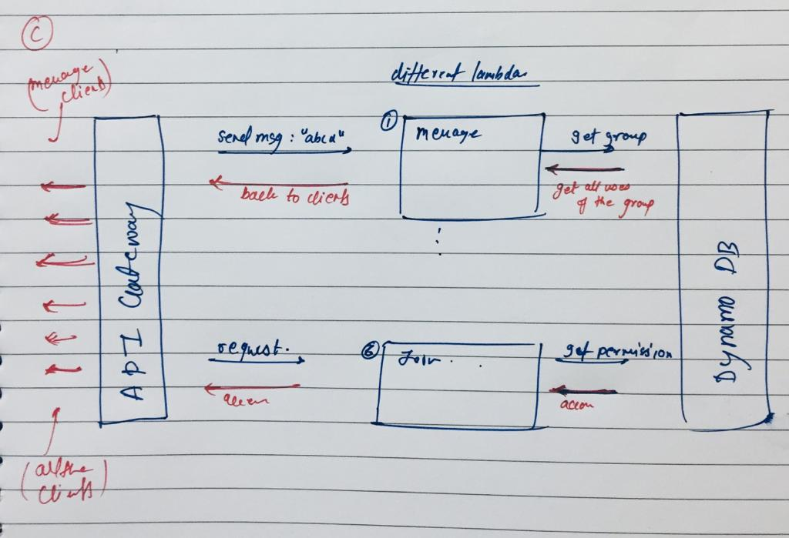

<i>

## What is this? 🤔
---
Ever feel like you could talk to someone while watching a movie or a lecture. Koi na now you got streamly with this you can chat with the persons you are already watching the same video as you are.

Here 😳, [live link](https://ineuron.tanishqsingh.live) (will be slow coz images are not optimized and are of large size).

### How things works
we use highly scalable websockets to provide connection to every single user.

### Technologies we use 😄
- API Gateway, Lambda, DynamoDB -> Server
- React, ec2, serve, nativebase -> Client
- Typescript, ESlint -> To maintain code
- Github workflow -> To manage ci/cd
- Nginx -> Proxy Management
- pm2 -> To manage serving build

### How scalable is this really? 😂
we don't connect 👉👈 user to directly to our backend rather we give this job to AWS 💪 itself, AWS API Gateway provides a brick where all user are connected and then all the requests are made as in form of https to our lambdas (back and forth).

*all this means highly scalable 🤦‍♂️

## How client get its js bundle to run in the browser 👽
---



## How client gets connected to the websocket 🪜
---


## How api gateway get its data from lambda 🤖
---



## Getting Started
---

### 1. Using node

```bash
# Install the application dependencies
cd client && npm install

# Build the applicaion
cd client && npm run build

# Start the server
cd client && serve -s build     # prod
cd client && npm start          # dev
```

### 2. Using docker

```bash
# Build the docker image
cd client && docker image build -t hey_there_everyone .

# Run the docker container
docker run -p 3000:3000 hey_there_everyone
```

Open [http://localhost:3000](http://localhost:3000) with your browser to see the result.


</i>